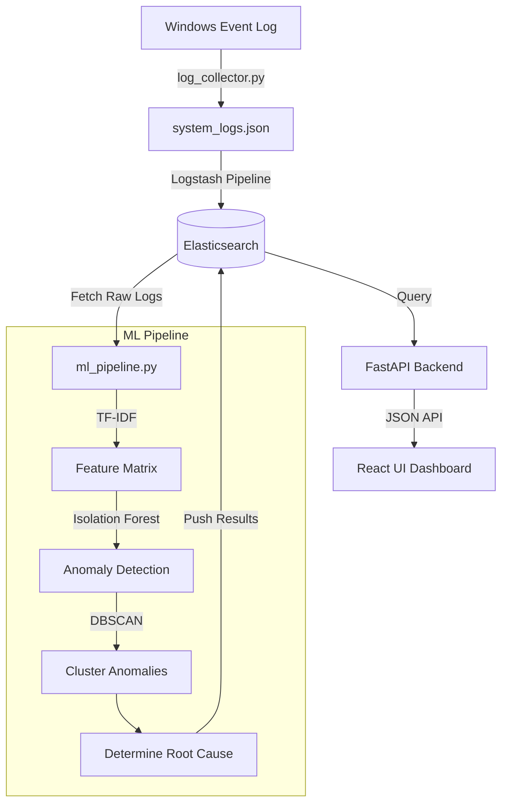

# Sortiskeos: Intelligent Log Analysis & Root Cause Detection System

 *(Imagine Dashboard Screenshot Here)*

Sortiskeos is a modern, AI-driven log analysis system specifically designed to automatically detect anomalies and identify root causes from large-scale system logs following sudden system crashes (e.g., Windows BSODs, unexpected power losses).

It integrates the ELK stack with machine learning (Isolation Forest and DBSCAN) to turn raw event logs into actionable root cause insights.

---

## 🏗️ Architecture & Data Flow

### High-Level Workflow
1. **System Crash:** An unexpected shutdown or Kernel-Power event occurs.
2. **Startup Trigger:** Upon reboot, `startup_trigger.py` detects the reboot and fires the collector.
3. **Log Collection:** `log_collector.py` parses Windows Event Logs up to 3 hours prior to the crash, writing them to a JSON line staging file.
4. **Ingestion:** Logstash observes the staging file, normalizes the structure, and indexes it into Elasticsearch.
5. **Machine Learning:** `ml_pipeline.py` reads the ingested logs, isolates anomalies, clusters them to find the most dominant failure pattern (Root Cause), and writes the insight back to Elasticsearch.
6. **Visualization:** The FastAPI backend serves the React frontend to display intuitive dashboards and root cause reports to the user.

---

## ⚙️ Component Breakdown & Functionalities

### 1. The Machine Learning Engine (`/ml`)

The intelligence of Sortiskeos lives in its Python-based machine learning modules.

- **`log_collector.py`**
  - Connects to the Windows Event API via `pywin32`.
  - Specifically searches for critical shutdown events (e.g., `Event ID 41`, `6008`, `1001`).
  - Scrapes all generic application, system, and security logs in the time window leading up to the crash.
  - Outputs a standardized `system_logs.json`.

- **`ml_pipeline.py`**
  - **Normalization**: Uses Regex to scrub varying artifacts from messages (IP addresses, GUIDs, Hex IDs) so that raw templates remain.
  - **Feature Engineering**: Uses `TfidfVectorizer` to convert text logs into dense numerical feature matrices.
  - **Anomaly Detection**: Runs an `IsolationForest` to strictly flag statistically irregular log items.
  - **Clustering (Root Cause)**: Feeds anomalies into `DBSCAN` to bin related errors. It hypothesizes that the largest, densest cluster of anomalies immediately preceding a crash is the **Root Cause**.

- **`startup_trigger.py` & `register_task.bat`**
  - Designed to register a Windows Scheduled Task prioritizing system boot & Kernel-Power failures over standard execution, guaranteeing the pipeline runs natively after a crash.

### 2. ELK Stack Configuration (`/elk`)

- Uses Docker Compose to spin up **Elasticsearch**, **Logstash**, and **Kibana**.
- **Logstash Config (`logstash.conf`)**:
  - Implements a file-watcher on the JSON logs from the collector.
  - Assigns severity scores mapping string log levels to integer severities (e.g. `CRITICAL` -> 5, `ERROR` -> 4).
  - Annotates tags like `suspicious` and `critical_event` using Regex rules on the message string.
  - Pushes directly to daily rotated indices in Elasticsearch (`system-logs-YYYY.MM.dd`).

### 3. FastAPI Backend (`/api`)

Provides the query layer standing between the massive dataset in Elasticsearch and the end-user.

- **`/dashboard/rootcause`**: Identifies the highest-scoring anomaly cluster stored by the ML layer and reports confidence levels, labels (e.g., 'Disk I/O', 'Memory Pressure'), and gives actionable fixes.
- **`/dashboard/timeline`**: Fetches an hourly aggregation of anomaly severities yielding data series for UI line charts.
- **`/dashboard/crashes`**: Fetches historical crashes allowing historical system instability reviews.
- **`/pipeline/run`**: Exposes a webhook endpoint to manually execute data collection and the ML pipeline asynchronously via `subprocess`.

### 4. React Frontend (`/ui`)

- Provides an interactive GUI for sysadmins.
- Reads aggregated metrics regarding total crashes and highlights the pinpointed Root Cause in plain English.
- (Runs on `http://localhost:3000` assuming standard React settings.)

---

## 🚀 How to Run the Project

The system provides a newly created bat file to initialize all required continuous services concurrently:

> [!TIP]
> **Use the single launch script**
> Run `run_all.bat` from the root directory. It will open separate terminals running ELK, FastAPI, and React simultaneously.

**Manual Step-by-Step:**
1. **ELK**: Navigate to `/elk` and run `docker-compose up -d`.
2. **API**: Navigate to `/api` and run `uvicorn main:app --reload --port 8000`.
3. **UI**: Navigate to `/ui`, run `npm install` (first time), and then `npm start`.

---

## 🔎 Anomaly Detection Heuristics Explained

> [!NOTE]
> **Why Isolation Forest + DBSCAN?**
> System logs are traditionally highly repetitive but lack standard formatting.
> 1. *Isolation Forest* isolates logs that structurally differ from the vast majority of standard "heartbeat" or info logs. 
> 2. *DBSCAN* is density-based. If a specific driver begins cascading failure logs, DBSCAN identifies these anomalies as a single grouped "cluster". Sortiskeos ranks the densest group as the highest probability Root Cause.
